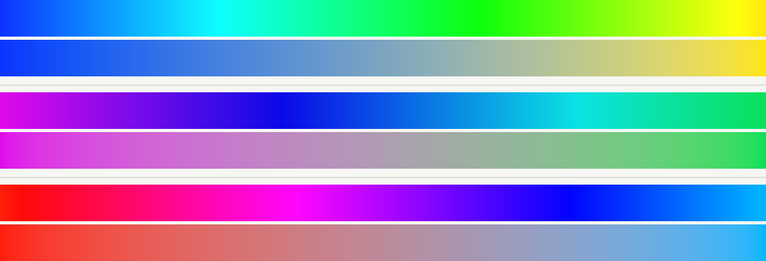
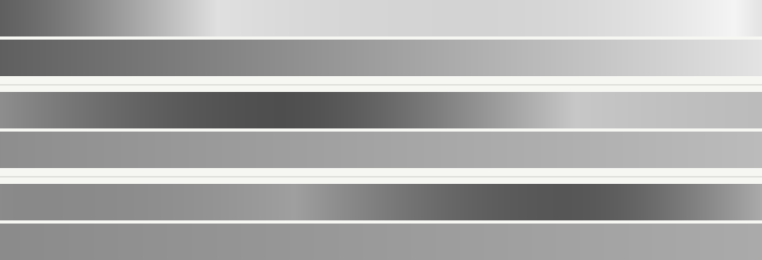

# OkColor

OkColor is a Swift package for working with the Oklab family of color spaces. It
provides value types for Oklab, OkLch, OkHSL, OkHSV, linear sRGB, gamma-encoded
sRGB, and XYZ, plus conversions, interpolation, gamut helpers, and harmony
utilities.

## Origin

Oklab was designed by [Björn Ottosson](https://bottosson.github.io/). The color
space was introduced in his research article
[A perceptual color space for image processing](https://bottosson.github.io/posts/oklab/),
published in 2020.

This package implements Ottosson's sRGB/Oklab, OkHSL, OkHSV, and gamut-helper
math in Swift. The original C++ reference sources are included under
`ReferenceSources/OkColor`.

## Premise

RGB is convenient for displays, but it is not perceptually uniform: equal numeric
changes in RGB do not usually look like equal visual changes. Oklab is designed
for image and UI color work where perceived lightness, chroma, and hue should be
more predictable.

Use Oklab when you want smoother gradients, perceptual interpolation, or color
adjustments that better preserve perceived hue and lightness. Use OkLch when the
same space is easier to work with as lightness, chroma, and hue. Use OkHSL and
OkHSV when you want familiar HSL/HSV-style controls backed by Oklab's perceptual
model.

## Visual Comparison

These generated comparisons use three saturated endpoint pairs. In each pair, the
upper strip is classic HSL interpolation and the lower strip is OkColor's Oklab
interpolation.



The grayscale version converts each sampled color to a neutral gray with the same
Oklab lightness, making uneven lightness shifts easier to spot.



## Installation

Add the package to a Swift package manifest:

```swift
.package(name: "OkColor", url: "https://github.com/eliseyOzerov/okcolor-swift", branch: "main")
```

Then depend on the library product:

```swift
.product(name: "OkColor", package: "OkColor")
```

Import it where needed:

```swift
import OkColor
```

## Public API

### Color Models

The core value types are plain `Double` structs and are safe to use across Apple
platforms without UIKit/AppKit dependencies.

```swift
public struct SRGB: Equatable, Hashable, Sendable {
	public var red: Double
	public var green: Double
	public var blue: Double

	public init(_ red: Double, _ green: Double, _ blue: Double)
	public var linear: LinearSRGB
	public var okLab: OkLab
	public var okLch: OkLch
	public var okHsl: OkHsl
	public var okHsv: OkHsv
}

public struct LinearSRGB: Equatable, Hashable, Sendable {
	public var red: Double
	public var green: Double
	public var blue: Double

	public init(_ red: Double, _ green: Double, _ blue: Double)
	public var srgb: SRGB
	public var unclampedSRGB: SRGB
	public var okLab: OkLab
}
```

`LinearSRGB.srgb` clamps each channel into the displayable sRGB gamut before
gamma encoding. Use `unclampedSRGB` when you need direct parity with the C++
transfer function for out-of-gamut linear values.

Oklab-style spaces:

```swift
public struct OkLab: Equatable, Hashable, Sendable {
	public var l: Double
	public var a: Double
	public var b: Double

	public init(_ l: Double, _ a: Double, _ b: Double)
	public init(srgb: SRGB)
	public init(linearSRGB rgb: LinearSRGB)
	public init(xyz: XYZ)

	public var srgb: SRGB
	public var linearSRGB: LinearSRGB
	public var xyz: XYZ
	public var okLch: OkLch
	public var okHsl: OkHsl
	public var okHsv: OkHsv

	public func lerp(to other: OkLab, t: Double) -> OkLab
}

public struct OkLch: Equatable, Hashable, Sendable {
	public var l: Double
	public var c: Double
	public var h: Double

	public init(_ l: Double, _ c: Double, _ h: Double)
	public init(oklab lab: OkLab)
	public init(srgb: SRGB)

	public var oklab: OkLab
	public var srgb: SRGB
	public var hue: OkHue

	public func darker(_ percentage: Double) -> OkLch
	public func lighter(_ percentage: Double) -> OkLch
	public func saturate(_ percentage: Double) -> OkLch
	public func desaturate(_ percentage: Double) -> OkLch
	public func rotated(_ degrees: Double) -> OkLch
	public func complementary() -> OkLch
	public func splitComplementary() -> [OkLch]
	public func triadic() -> [OkLch]
	public func tetradic() -> [OkLch]
	public func analogous(count: Int, angle: Double) -> [OkLch]
	public func shades(count: Int) -> [OkLch]
	public func tints(count: Int) -> [OkLch]
	public func lerp(to other: OkLch, t: Double, shortestPath: Bool) -> OkLch
}
```

OkHSL and OkHSV mirror the Dart package's perceptual HSL/HSV controls:

```swift
public struct OkHsl: Equatable, Hashable, Sendable {
	public var h: Double
	public var s: Double
	public var l: Double

	public init(_ h: Double, _ s: Double, _ l: Double)
	public init(srgb: SRGB)
	public var srgb: SRGB
}

public struct OkHsv: Equatable, Hashable, Sendable {
	public var h: Double
	public var s: Double
	public var v: Double

	public init(_ h: Double, _ s: Double, _ v: Double)
	public init(srgb: SRGB)
	public var srgb: SRGB
}
```

Both types include `darker`, `lighter`, `saturate`, `desaturate`, `rotated`,
color harmony helpers, `shades`, `tints`, and shortest-path hue interpolation.

### Utilities

```swift
public enum OkColor {
	public static func interpolate(_ start: SRGB, _ end: SRGB, t: Double, method: OkColorInterpolationMethod, shortestPath: Bool) -> SRGB
	public static func gradient(from start: SRGB, to end: SRGB, count: Int, method: OkColorInterpolationMethod, shortestPath: Bool) -> [SRGB]
}

public enum OkColorInterpolationMethod {
	case oklab, okhsv, okhsl, oklch, hsv, rgb
}

public enum OkGamut {
	public static func computeMaxSaturation(_ a: Double, _ b: Double) -> Double
	public static func findCusp(_ a: Double, _ b: Double) -> (l: Double, c: Double)
	public static func findGamutIntersection(_ a: Double, _ b: Double, l1: Double, c1: Double, l0: Double, cusp: (l: Double, c: Double)) -> Double
	public static func toe(_ x: Double) -> Double
	public static func toeInverse(_ x: Double) -> Double
}

public enum OkGamutClipping {
	public static func preserveChroma(_ rgb: LinearSRGB) -> LinearSRGB
	public static func projectToPointFive(_ rgb: LinearSRGB) -> LinearSRGB
	public static func projectToCusp(_ rgb: LinearSRGB) -> LinearSRGB
	public static func adaptivePointFive(_ rgb: LinearSRGB, alpha: Double = 0.05) -> LinearSRGB
	public static func adaptiveCusp(_ rgb: LinearSRGB, alpha: Double = 0.05) -> LinearSRGB
}
```

## Reference Parity

The package keeps Ottosson's original C++ reference under
`ReferenceSources/OkColor`. The Swift source files are split by model and helper
area, with comments above the main constant blocks naming the corresponding C++
functions. The README comparison images can be regenerated with
`python3 Scripts/generate_gradient_comparisons.py`.

C++ parity fixtures are generated by
`ReferenceSources/OkColor/generate_cpp_parity_fixtures.cpp` and checked in at
`Tests/OkColorTests/Fixtures/CppParityFixtures.json`. The Swift test suite reads
that JSON through `Bundle.module` and compares sRGB transfer, Oklab, OkLch,
OkHSL, OkHSV, and all five gamut clipping strategies against the reference
output.

One deliberate difference is kept for Dart-package parity: OkHSV scale guards use
`1e-10` where the C++ reference uses `0.f`. This avoids division-by-zero edge
cases and matches the Flutter package behavior that this Swift package mirrors.

## Examples

Convert sRGB to Oklab and back:

```swift
let red = SRGB(1, 0, 0)
let lab = OkLab(srgb: red)
let rgb = lab.srgb
```

Interpolate two colors perceptually:

```swift
let start = OkLab(srgb: SRGB(0.2, 0.4, 1.0))
let end = OkLab(srgb: SRGB(1.0, 0.4, 0.2))
let middle = start.lerp(to: end, t: 0.5).srgb
```

Adjust chroma in OkLch:

```swift
var color = OkLch(srgb: SRGB(0.4, 0.7, 0.9))
color.c *= 1.2
let saturated = color.srgb
```

Generate a perceptual OkHSL gradient:

```swift
let colors = OkColor.gradient(
	from: SRGB(0.2, 0.4, 1.0),
	to: SRGB(1.0, 0.4, 0.2),
	count: 7,
	method: .okhsl
)
```
